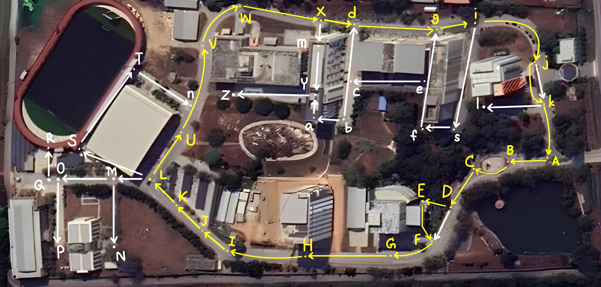

# ข้อมูลเส้นทางถนนภายในวิทยาเขตระยอง

โครงการนี้รวบรวมและเผยแพร่ **ข้อมูลเส้นทางของถนนภายในวิทยาเขตระยอง** โดยประกอบด้วยข้อมูล 2 รายการหลัก:

- **ระยะทางของถนน** (หน่วย: เมตร)
- **ความชันของถนน** (หน่วย: องศา)

ข้อมูลถูกจัดเก็บในรูปแบบไฟล์ `.csv` เพื่อความสะดวกในการนำไปใช้งาน เช่น วิเคราะห์ เสนอรายงาน หรือแสดงผลร่วมกับแผนที่

## โครงสร้างไฟล์ CSV

ไฟล์ข้อมูลมีรูปแบบดังนี้:

| ระยะทาง (m) | ความชัน (องศา) |
|--------------|------------------|
| 100.0        | 3.5              |
| 200.0        | 5.2              |
| 300.0        | -2.2             |
| 400.0        | -1.8             |
| ...          | ...              |

## แผนที่ภายในมหาวิทยาลัย

